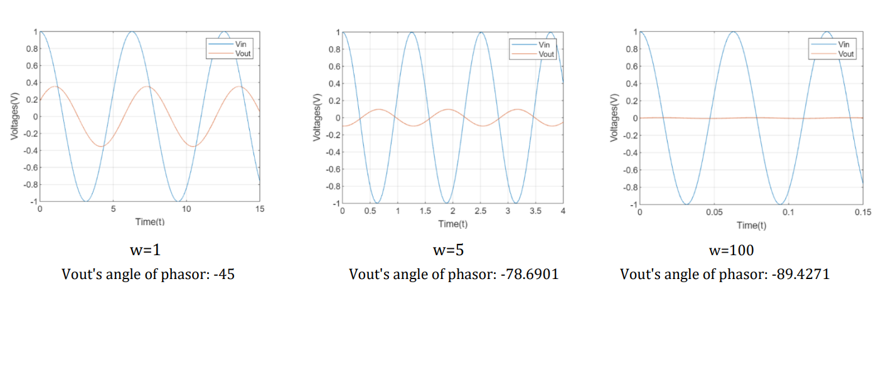

# Circuit And Systems Analysis Homework 

For the given the Circuit A, there are the 
ideal independent voltage source Vin, the 
resistors R1, R2, R3, the capacitor C and the 
inductor L. Vin(t)=cos(wt) V, R1=1Ω, 
R2=1Ω, R3=1Ω L=1 H, C=1 F. In order to 
get Vin and Vout voltage characteristic in a 
steady-state analysis according to time, 
please write a Matlab code which represents 
The Circuit A. The length of the time period 
must be at least twice of the period of 
Vin(t).

* # Circuit Diagrams

* #  Outputs

