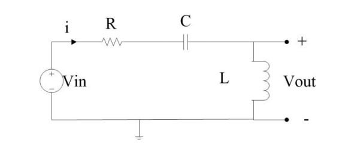
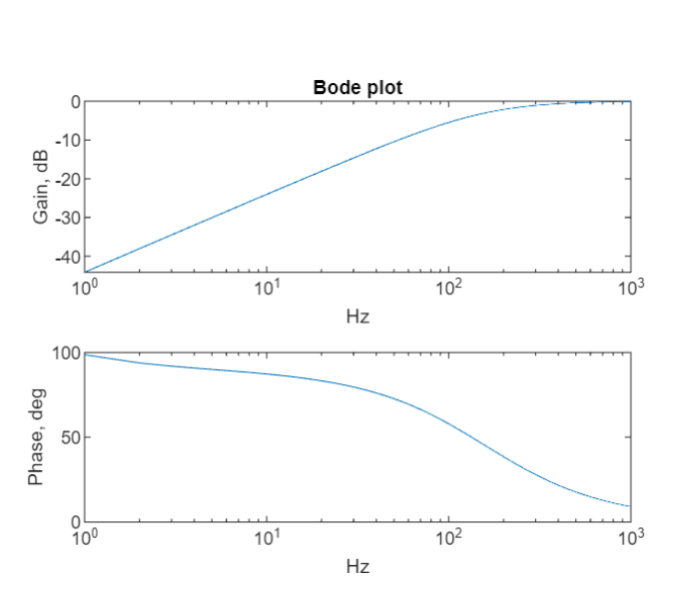

# Circuit And Systems Analysis Homework 

Circuit And Systems Analysis Homework.
For the given the Circuit B, there are the 
ideal independent voltage source Vin, the 
resistor R, the capacitor C and the inductor 
L. Vin(t)=cos(wt) V, R=100Ω, L=0.1 H, 
C=0.01 F. In order to get a Bode plot (gain 
and phase angle) in a steady-state analysis 
according to frequency, please write a 
Matlab code which represents The Circuit 
B. The length of the frequency period must 
be at least from 1Hz to 1kHz.
H(w) = Vout(w) / Vin(w).
- Bode plot for magnitude of H(w) 
(gain in dB) according to frequency in Hz? 
- Bode plot for phase angle of H(w) 
(angle in degree) according to frequency in Hz?

* # Circuit Diagrams

* #  Outputs

