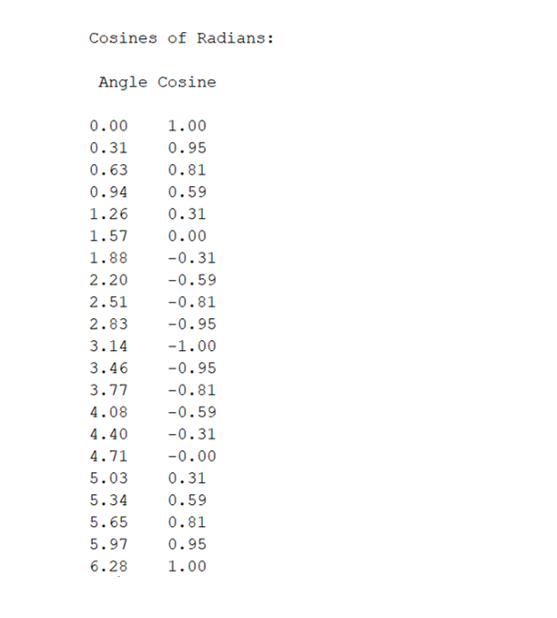

Before calculators were readily available (about 1974), students used tables to determine the values of mathematical functions like sine, cosine, and log.
Created such a table for cosine, using the following steps:
# 
  Create a vector of angles from 0 to 2π in increments of π/10.

  Calculate the cosine of each of the angles, and group your results into a matrix that includes the angle and the cosine of the angle.

  Use disp function to create a title for the table and use fprintf function to create column headings.

  Then, use the fprintf function to display the numbers. Display only two values past the decimal point.

#

