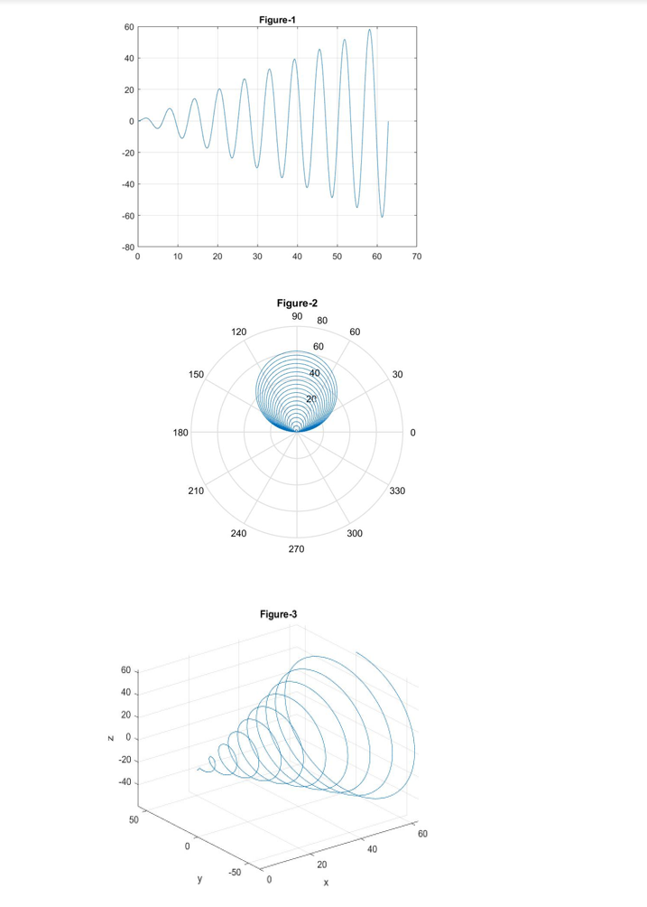

An x vector with values in the π/100 range from 0 to 20π was created.
y and z vectors were defined as y = xsin(x) and z = xcos(x) 
* (a) Create an x–y plot of x and y.
* (b) Create a polar plot of x and y.
* (c) Create a three-dimensional line plot of x, y, and z.

Add suitable titles and axis labels to all plots.
# Respectively x y and z vectors
